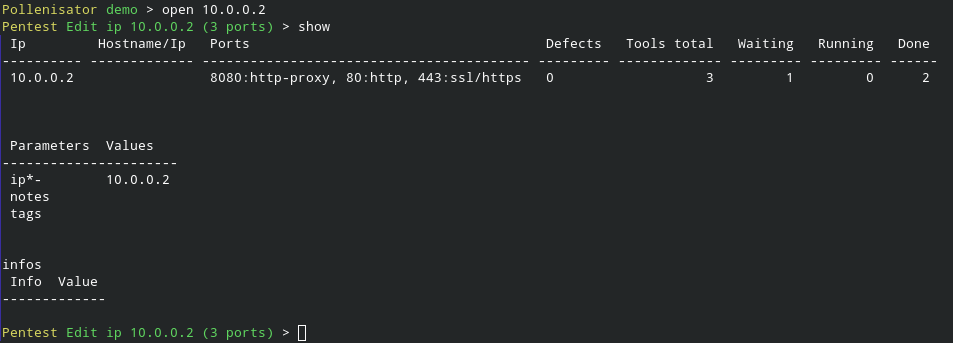

# PollenisatorCLI
Command Line Interface client for pollenisator

### Installation:

```
git clone https://github.com/fbarre96/PollenisatorCLI
cd PollenisatorCLI
pip install .
```

### Usage

Run it as CLI
```pollenisatorcli [--host XXX.XXX.XXX.XXX --port 5000 --http]```

OR

Run it in shell
```pollenisatorcli ls ips```

### Login


### Create a pentest


### Forms
For every forms you can use show/set/unset or use the wizard


### Open a Pentest
Autocompletion with TAB is available on most commands / parameters.

```
Pollenisator > ls
Pentests:
==========
demo
AlgoSecure-Training
algo-test
test-algo
```


### List hosts of a pentest


### List all tools executed on an ip


### Insert an new object in database


### Interact with objects


### Import existing tools results
Pollenisator server has plugins that auto-detects which tool generated it and extract informations.


### Execute commands to import automatically
Pollenisator server has plugins that auto-detects which tool you are trying to execute it and modify it with its expected output argument so you don't have to worry about which format is exepected.


### Execute any command from anywhere and import them

#### Pollex
  Pollex allows you to execute and import commands from any terminal if you are connected.
  
  ```$ pollex nmap -p80,443 10.0.0.0/24```
#### Terminal
  You can also spawn a terminal configured to trap every command and send them to pollenisator using
  
  ```Pollenisator demo > terminal trap_all```


### Manage workers
#### Boot a new worker from docker

#### List workers and allow them on your pentest

#### Execute a tool using a worker


### Auto scan 
If workers are configured, you can perform an auto-scan that will execute programed commands


### Dashboard


### Reporting module


Then you can generate a powerpoint or word document


### Script manager
Write custom scripts to interact with the API


